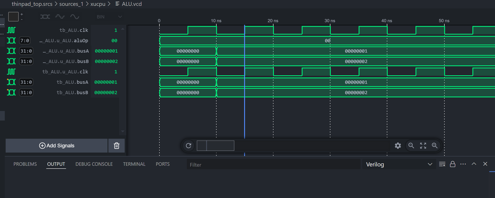

# 微软大战verilog

在体系结构-CPU设计的课程中完成小组作业，然后开始了verilog的学习

起因是觉得vivado真的好丑代码看起来好丑好丑，整个配置虽然全面但是互不兼容，这很不好，然后先下载了Modelsim SE-64 10.4和Icarus Verilog，iverilog配置比较简单，因为Modelsim SE-64 10.4专业版需要💴，所以后面又看了很多教程破解，后面发现还是iverilog好用，但是还是记录一下。（Modelsim SE-64 10.4是因为仿真和vivado一样微全面，但是兼容性比较好）

## Modelsim SE-64 10.4

这个主要参考了[教程](https://blog.csdn.net/github_33678609/article/details/53493673?locationNum=6&fps=1)，按照这个教程基本没啥问题，但是就是加环境变量的时候加错了位置，所以一直打不开，其他的就还好。

## iverilog

主要参考了[教程]([VScode配置verilog环境(代码补全，报错，波形仿真)_vscode verilog-CSDN博客](https://blog.csdn.net/weixin_60094035/article/details/126532981))

其实比较重要的就是FPGA那个logo的verilog-HDL以及WaveTrace(用来波形跟踪）还有一个testbench（自动生成testbench)这几个比较重要

其他的按照这就可以，就是testbench的时候要在这个文件中加信号的定义和先后顺序，自动生成的只有一个模板没有测评的具体东西，打开vcd里面是啥也没有的，所以这部分是要手动填写的，一下是一个对alu的测试testbench代码

```verilog
`include "ALU.v"
`include "ALUOp.vh"
`timescale 1ns/1ps

module tb_ALU;
    parameter PERIOD = 10;

    reg clk = 0;
    reg rst = 1;       // 初始复位有效
    reg [31:0] busA = 0;
    reg [31:0] busB = 0;
    reg [7:0] aluOp = 0;
    wire [31:0] aluOut;

    // 生成时钟
    always #(PERIOD/2) clk = ~clk;

    // 释放复位
    initial begin
        #(PERIOD*2) rst = 0;  // 20ns后释放复位
    end

    // 实例化ALU
    ALU u_ALU (
        .clk(clk),
        .rst(rst),
        .busA(busA),
        .busB(busB),
        .aluOp(aluOp),
        .aluOut(aluOut)
    );

    // 主测试逻辑
    initial begin
        $dumpfile("ALU.vcd");
        $dumpvars(0, tb_ALU);  // 记录所有层次信号

        // 初始化输入(这里是手动添加的)
        #10;  // 等待复位生效
        busA = 32'h1;
        busB = 32'h2;
        aluOp = `ALU_ADD;

        // 变更操作码测试不同功能
        #100;
        aluOp = `ALU_SUB;
        busA = 32'h5;
        busB = 32'h3;

        // 结束仿真
        #200 $finish;
    end
endmodule
```

生成波形如下


